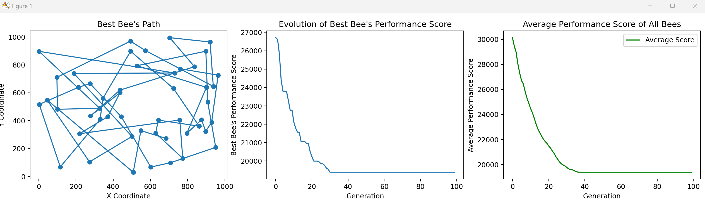

# 
Honey Bee

## Context of the project
This project involves solving an optimization problem inspired by bee behavior, using a genetic algorithm. Bees seek to minimize the total distance traveled to collect nectar in an environment with several flowers.

## Issues 
In a CSV file, we have the coordinates of our 50 flowers. Now, how can bees find the best path to nectar by minimizing the distance they travel? 
The challenge is to find out how the bees can make their way more intelligently. And to do this, we use genetic algorithms. This algorithm will help the bees become more and more efficient in the way they choose which flowers to visit, generation after generation. 

### What is genetic algorithm ? 
The genetic algorithm is a method for solving both constrained and unconstrained optimization problems that is based on natural selection, the process that drives biological evolution. The genetic algorithm repeatedly modifies a population of individual solutions. At each step, the genetic algorithm selects individuals from the current population to be parents and uses them to produce the children for the next generation. Over successive generations, the population "evolves" toward an optimal solution. 

## Solutions 
- Each bee is represented by a set of flower coordinates, which determines the order in which they visit them.
- A bee's performance is evaluated by calculating the sum of the distances between the flowers in its set of coordinates. The smaller the sum, the better the performance.
- The bee colony starts at 100 and remains there throughout the generations, replacing the slowest bees by those with the best performance score.
- At each generation, the bees are sorted according to their performance, and only the 50 best are kept.
- Two parent bees are randomly selected from the top 50, and two new children are created by combining the parents' coordinates.
- This process is repeated over several generations (100 times in my case), favoring the best-performing bees. The result is a gradual improvement in performance.

## Graphic representation 

The first graph shows the path taken by the best bee in each generation. The X and Y coordinates represent the positions of the flowers visited by the bee. It illustrates the specific path taken by the best bee in each generation, showing how its choice of flower coordinates evolves to become more efficient over time.

The second graph shows how the performance score of the best bee evolves over the generations. Initially, the performance score is high, but gradually decreases as the bees reproduce. However, we can see that the score of the best bee stagnates at a certain point, which means that the entire bee population may be experiencing temporary difficulties in improving its performance.

Finally, the third graph shows the average performance scores of all bees in each generation. As with the graph of the best bee score, the same behavior can be observed. 

## Conclusion 
This project demonstrates the application of a genetic algorithm to solve an optimization problem inspired by bee behavior. By using successive generations of bees and favoring the best-performing individuals, we can gradually work towards an optimal path through a field of flowers. The results are visualized in graphs, showing the path taken and the evolution of the performance of the best bee and the average performance of all the bees over the generations.